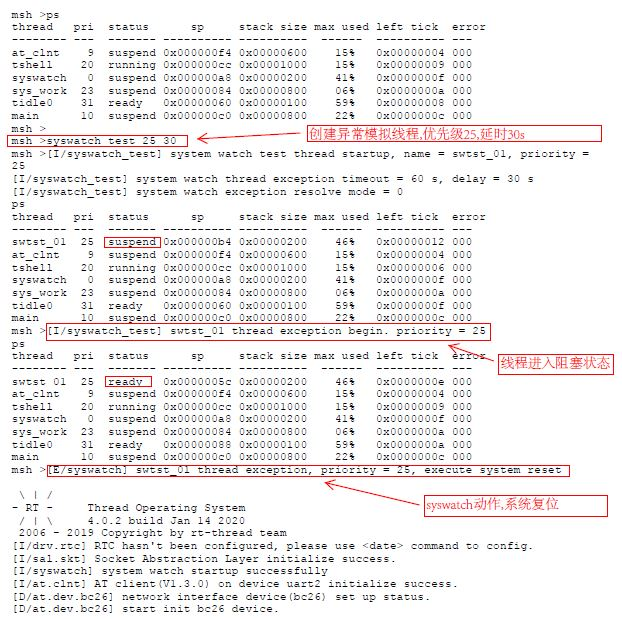
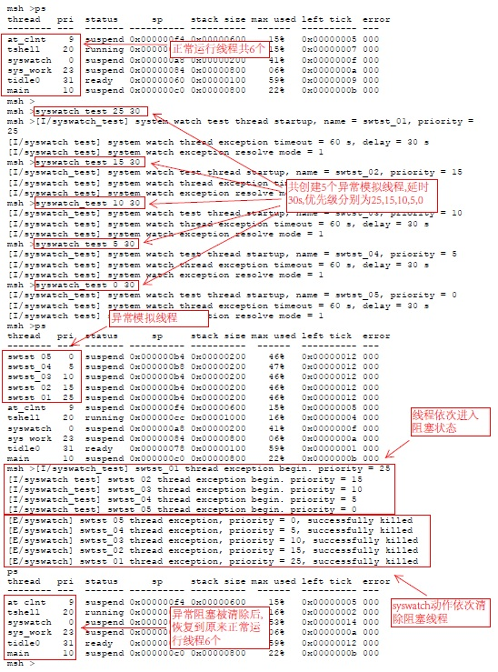
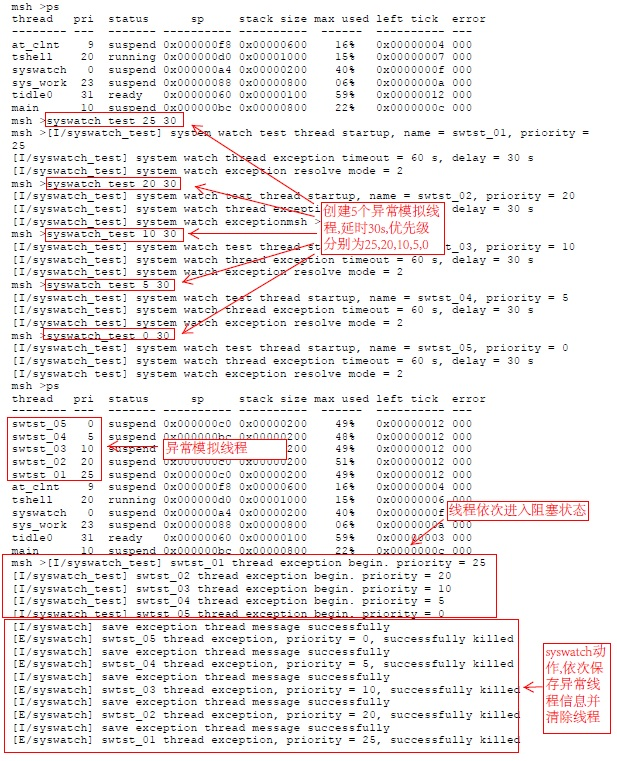
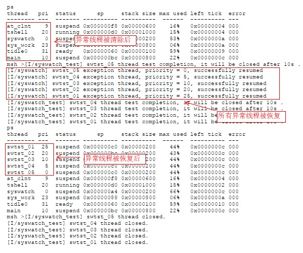

# 系统看守

## 1.简介

**系统看守(syswatch)组件** 主要功能是保障实时操作系统正常运行，防止系统死机以及各种异常引起的线程阻塞，保障整个系统长期正常运行。系统看守具备以下几种行为模式：
1.系统崩溃或硬件异常导致系统失去调度时，执行 `系统复位` 恢复系统正常运行。
2.当有异常导致某些线程长时间阻塞时，可根据用户的配置实施 `系统复位` / `杀掉阻塞线程` / `重启阻塞线程` 的方式恢复系统正常运行。

### 1.1工作原理简述 

**系统看守(syswatch)组件** 使用实时操作系统中允许的最高优先级作为看守线程的优先级，保障看守线程不会被阻塞，同时看守线程由看门狗提供看护，保障看守线程正常运行；系统看守通过 `线程调度回调接口` 监测线程的调度情况，当检测到有线程发生异常阻塞时，开始检测和确认具体哪个线程发生了异常阻塞，最后根据异常解决模式执行  `系统复位` / `杀掉阻塞线程` / `重启阻塞线程` 清除异常，使系统恢复正常运行。

### 1.2文件组成

|文件|说明|
|----|----|
|syswatch_config.h|组件参数配置头文件，配置组件的使能、工作模式等工作参数|
|syswatch.h|组件API接口头文件，定义了供用户使用的接口函数，以及参数定义等|
|syswatch.c|组件的主功能模块，实现系统运行监测，线程异常识别，异常解决等功能|
|syswatch_test.c|组件的测试功能模块，模拟异常线程，用于测试和验证组件功能|

### 1.3许可证

syswatch package 遵循 LGPLv2.1 许可。

### 1.4依赖

- RT_Thread 4.0
- RT_Thread watchdog device
- RT_Thread enable system hook

## 2.使用

### 2.1获取组件

- **方式1：**
1.下载syswatch软件包，并将软件包`syswatch`文件夹复制到工程原码目录下
2.将软件包中syswatch.c和syswatch_test.c加入项目工程中
3.将软件包中syswatch_config.h中 `RT_USING_SYSWATCH` 和 `RT_USING_SYSWATCH_TEST` 两个宏的注释去掉;并根据需要修改各项配置参数

- **方式2：**
通过 *Env配置工具* 或 *RT-Thread studio* 开启syswatch组件软件包，根据需要配置各项参数。

### 2.2配置参数说明

|参数宏|说明|
|----|----|
|`SYSWATCH_EXCEPT_RESOLVE_MODE`|异常解决模式，可配置值0~2，默认值 2，0--复位系统，1--杀掉异常线程，2--重启异常线程
|`SYSWATCH_EXCEPT_TIMEOUT`|判定存在线程异常的超时时间，单位：秒，默认值 60
|`SYSWATCH_EXCEPT_CONFIRM_TMO`|确认异常线程的超时时间，单位：秒，默认值 15
|`SYSWATCH_EXCEPT_RESUME_DLY`|重启异常线程的延时时间，单位：秒，默认值 15
|`SYSWATCH_THREAD_PRIO`|系统看守线程的优先级，默认值 0
|`SYSWATCH_THREAD_STK_SIZE`|系统看守线程的堆栈尺寸，默认值 512
|`SYSWATCH_THREAD_NAME`|系统看守线程的名称，默认值 `syswatch`
|`SYSWATCH_WDT_NAME`|使用看门狗设备的名称，默认值 `wdt`
|`SYSWATCH_WDT_TIMEOUT`|使用看门设备的超时时间，单位：秒，默认值 5

## 3.注意事项

- syswatch 依赖于看门狗设备而工作，使用本组件时请确认已注册了看门狗设备。
- syswatch 全权管理看门狗，请不要在其它线程中使用和操作看门狗。
- syswatch 提供了3种异常解决模式，请根据实际需要配置适合的工作模式。
- `syswatch_set_event_hook` 提供用户安装事件回调函数，以便针对重要事件发生时进行一些必要处理，如系统复位前须对重要数据进行保存时，可设置回调函数完成相应处理，如不需要可不设置。

## 4.测试验证

组件安装后，为了验证其功能是否正常，组件提供了测试例程，可通过shell命令`syswatch_test`创建异常模拟线程。
`syswatch_test`命令参数有2个，第1个是创建线程的优先级，第2个是发生异常阻塞的延时时间。
如执行命令`syswatch_test 20 30`后，会创建一个优先级为20的线程，在线程开始运行30秒后，线程进入异常阻塞状态。

### 4.1模式0测试示例

### 4.2模式1测试示例

### 4.3模式2测试示例

